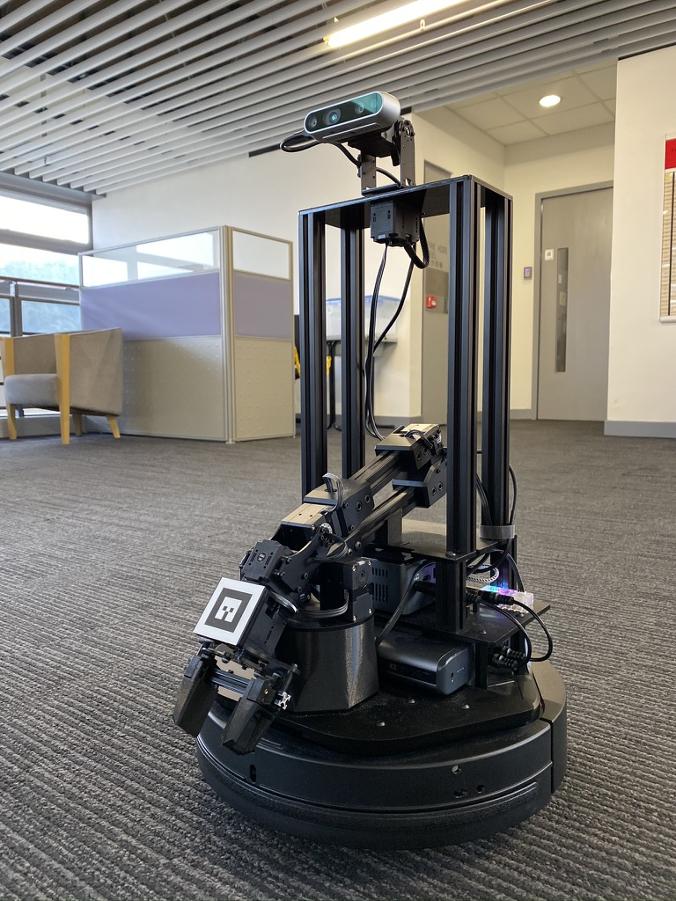

Much inspired by [openai_ros], this Open-source ROS Package [pyrobot-rl] cooperating OpenAI Gym and Baselines, MuJoCo Simulation environment, Gazebo Simulation environment as well as Facebook PyRobot/LoCoBot. It can be used to train and validate Deep RL control policy in  both MuJoCo and Gazebo Simulator for the Facebook PyRobot supported LoCoBot.

## PyRobot
PyRobot is an open-source project developed by Facebook Research Group. It abstract away writing ROS nodes and launch files for controlling the robot. User can simply write a Python script and call its library function to control and manipulate the robot. Right now, they have only support LoCoBot as their hardware platform.

## Documentation
-- Under Construction
