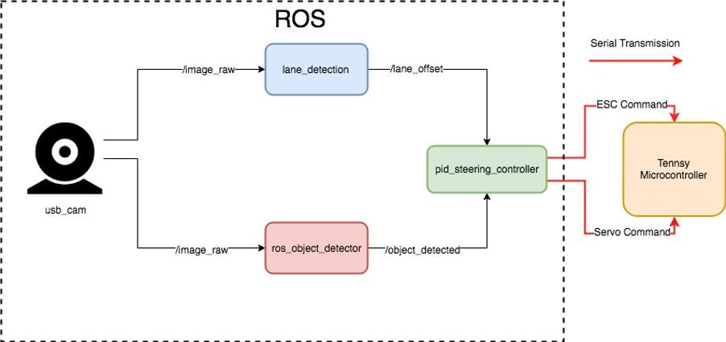

This project is my first project during my internship in SenseTime Corporation. It involved developing a 1:10 scale autonomous driving car capable of tracking double lane racetrack in real time and simple object detection. Solutions powered by OpenCV and Tensorflow had been adopted.

## Hardware Design
The hardware design of our autonomous driving car is mainly inspired by a famous opensource project – “Cherry Autonomous Racecar – 1/10th scale Nvidia Jetson TX1 based RC car”. The vehicle is based on a 2 wheel-drive, 1:10 scale truck kit from Traxxas (Model #58024). It has a rear-wheel drivetrain and a single front steering. A powerful brushed DC motor and a servo motor are being used for throttle and steer respectively. The car can be controlled via remote control or PWM signals generated by a Teensy Microcontroller board which is added by me. For the computing part, Nvidia Jetson TX1 is the brain of the vehicle. It processes all the sensory inputs and issuing desire steering angle to the Teensy Microcontroller. For sensory setup, only a high resolution and FPS Web Cam is mounted on the vehicle. Robotic Operation System (ROS Kinetic) is used as the middleware, cooperating different input/output streams and algorithms with its topics and nodes features.

## Challenges
The size of our racetrack is relatively smaller compared to some similar projects like the  Audi Autonomous Driving Cup (AADC) or BARC Project by UC Berkeley. The adverse effect of the camera blind spot is larger. For example, when the vehicle is doing a U turn, only partial part of the lane is detected; double lane detected is not guaranteed. It requires our lane tracking algorithm as well as the controller have to be more robust and react much faster. In addition, compare to single-lane following, double lane following is relatively more difficult as the centre reference lane is missing. Real time computing a reference point for the lateral PID controller to track is the key for the task.

## System architecture

## Double Lane Tracking algorithm

