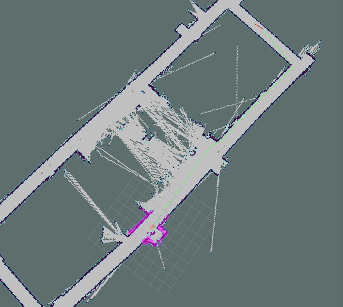

## Introduction
RobotCar is a 1/10 scale Autonomous vehicle prototype. It carries a suite of sensors, perception, planning, control modules that are similar to a full scale solutions. Compare to others prevalent commercial research robots like Jackal UGV or TurtleBot, RobotCar address the issues of realistic vehicle dynamics; Ackermann steering and the ability to travel at a high speed are the main difference among other mobile robot platforms.

RobotCar is capable for Simultaneous Localization and Mapping as well as Autonomous Indoor Navigation. Different Algorithms are adapted, such as Monte Carlo Localization, Kalman Filter, Particle Filter, Gmapping, as well as Timed-Elastic-Band Local Planning. The main architecture of the system is following the standard setup of ROS Navigation Stack.
RobotCar is equipped with different sensors as to measure the surrounding environment. It equips with a USB Camera, LiDar, and a 9 DOF IMU.

For a **Detail Documentation** of the project, as well as the  **Tutorial Guide for setting up the ROS Navigation Stack**. 
Please Check out my Github repositories for this project:
https://github.com/Tiga002/Autonomous_RaceCar

##
## Application

### Simultaneous Localization and Mapping -- SLAM
Incorporating the data gathered by Lidar and IMU, RobotCar is capable for building a 2D Top-View Map of an indoor environment at real time. The map can be exported and stored in local machine.

*SLAM Operation*

*HK Science Park 1W 2/F Map Built by SLAM*

### Indoor Navigation
By using the map built from SLAM Algorithms, RobotCar is able to locate itself on the map, and navigated to a goal destination by itself.
*Global Path Planning*

Indoor Navigation

