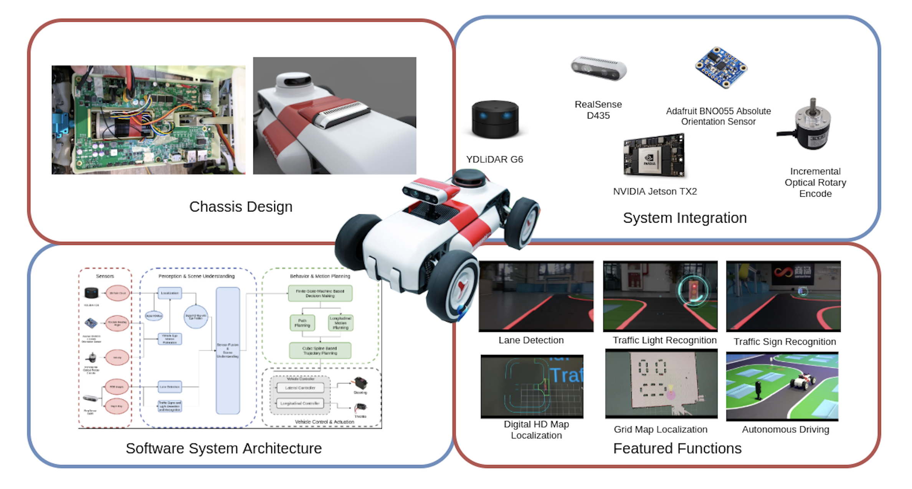
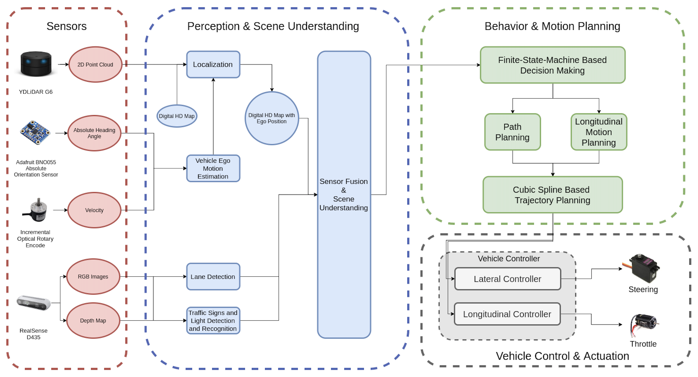

The entire mechatronic system and system architecture is a product of interdisciplinary team in the fields of mechanical design, electronics, software and deep learning. As a member of Autonomous Driving Research Team in SenseTime, I was one of the main developers of the SenseRover Pro. I was heavily involved in developing the localisation, path planning and control modules. Gratitude to the trust from my supervisor and benefited to my knowledge and experience on both hardware and software development, I was responsible for coordinating the development of different modules, as well as dealing with different hardware supplier and factories as to inform them our standards and product requirements.

## Introduction
SenseRover Pro is 1:10 scale autonomous driving car that miniaturing the level-4 autonomous driving system of a 1:1 autonomous driving car. It is equipped with all sort of sensors, actuators, and on-board computer which mimics the setup of a 1:1 autonomous driving car. System Pipeline and software design is much similar to a full scale solution. It is a commercialised educational product for different high school in Hong Kong and Mainland China.

## Overview of SenseRover Pro

SenseRover Pro is a miniature and simpler version of a full scale  level-4 self-driving car.    
It is equipped with a 2D LiDar, 3D camera, 9-DOF IMU, and a optical rotary encoder.
Nvidia Jetson TX2 is the on-board computer. It coordinates and processes all the sensory inputs and computing the desire throttle and steering angle to the STM32 Microcontroller.
Instead of simply following the ROS Navigation Stack setup, the system architecture and information pipeline is mostly the same with SenseTime Autonomous Driving Solution which is implemented on a 1:1 Honda experimental car.    

SenseRover Pro is capable for real time Neural Network based Lane Detection, Traffic Signs and Lights detection and recognition. The vehicle reacts differently according to its perception. For example, it stops when it sees the red light; it turns left when it sees the Turn Left Sign at the crossroad junction, etc. One more key feature of SenseRover Pro is Digital HD Map is utilised for providing the detail road information like the full-scale autonomous car does. Localisation is done by matching the 2D occupancy map from 2D SLAM with the Digital HD Map. Vehicle position is located on the Digital HD map in real time. According to its perception and scene understanding, a target point is generated. Then a constrained, time-efficient, cubic spline trajectory is optimised as the desired trajectory. Followed by the vehicle controller in case of MPC or simple PID, steering and throttle commands are computed and issued to the low-level STM32 Microcontroller.

## System Architectures of SenseRover Pro

